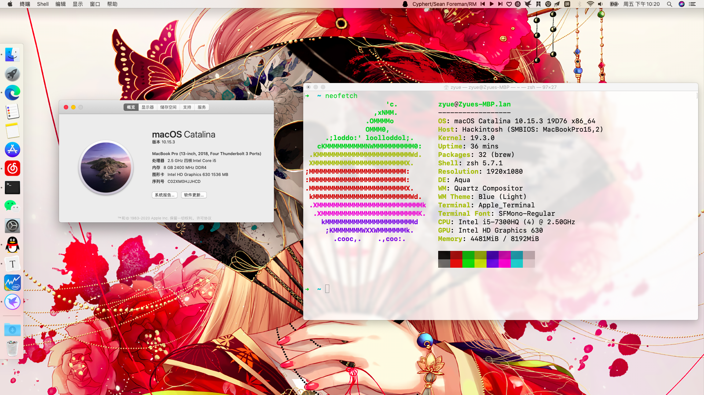
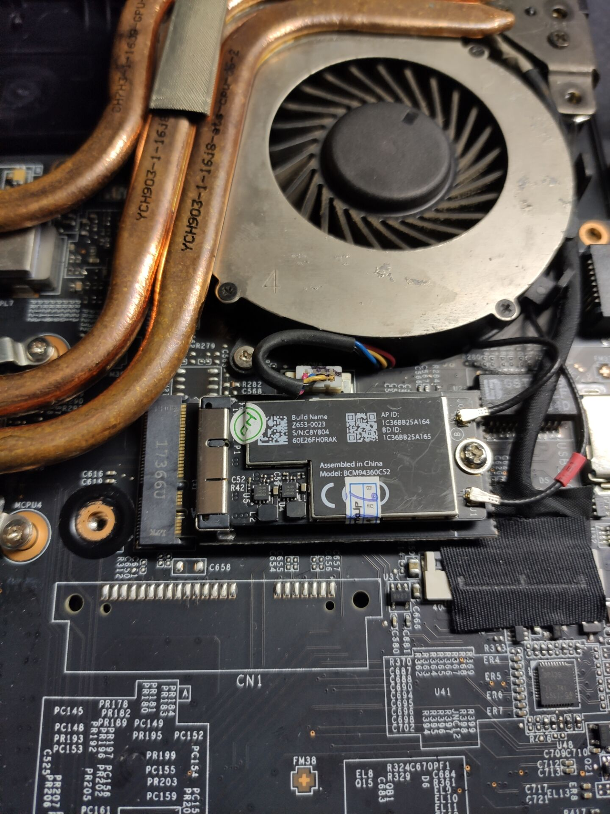

# macOS Catalina 10.15.3

## MSI-GL62M-7RDX-1286CN 配置

- [x] <b>型号</b>: `MSI-GL62M-7RDX` (2017)
- [x] <b>CPU</b>: `i5 7300H` (2.5 GHz)  4C4T
- [x] <b>显卡</b>: `UHD 630`
- [ ] ~~<b>显卡</b>: `GTX 1050`~~
- [x] <b>声卡</b>: `ALC898/ALC899`
- [x] <b>网卡</b>: 已经更换为免驱的`BCM94360CS2`

## 驱动完成进度

- [ ] ~~触摸板（解决不了，不可能有Mac原生的体验）~~
- [x] CPU监控
- [x] 睡眠问题(待调试)
- [ ] ~~HDMI（有画面，声音会和声卡驱动冲突）~~

# 关于配置

- 显卡GTX1050在新版已经不支持了，没必要去折腾了。

- 默认的hd630开启hidpi带来高分辨率享受的同时可能还会带来些许卡顿。

- 默认的ac3168无线网卡无解，无线必须更换网卡，我这里是用的免驱的`BCM94360CS2`，长度稍长，但能装得下。

  

# 关于EFI

多亏了github各位大神完善的驱动才能让我更快的吃上黑苹果。

我参考了很多这位大佬的orz：**EFI : https://github.com/aminenoidea/Hackintosh-GL63**

我把个人的EFI贴出来也是为了一些，相类似配置的朋友。

毕竟微星笔记本还是相对小众，相比神州，联想，华硕，戴尔，小米等，这些牌子网上前例已经非常多了，特别是神州和小米，我感觉人口基数巨多。

